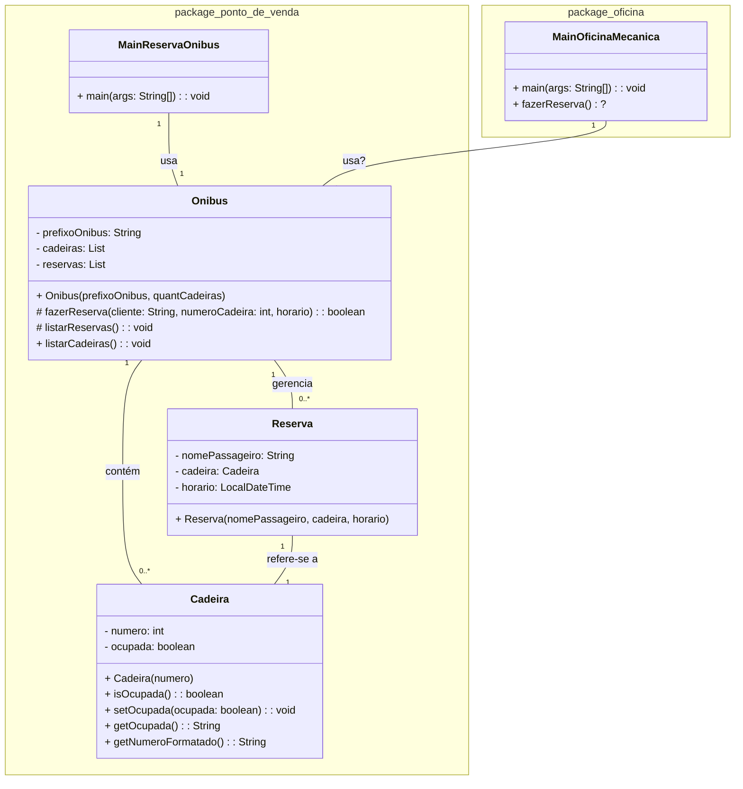

## Aula 6 - 23/08/2024 - Esteira de build, detalhes JDK, composição Aluno+Disciplina

### Correção do exercício 1

Correção do exercício 1, teoria da aula anterior, programa de reservas de cadeiras em ônibus.

### Exercício resolvido

## Unidade 1 - Exercício 2.1 - Com nota

### 0. (1,0) Reserva de Cadeira em um Ônibus

Crie um programa em Java para gerenciar reservas de cadeiras para passageiros em um ônibus, a ser usado por um atendente em um PDV na rodoviária. Sugere-se a criação das classes Cadeira, com uma identificação numérica e um indicativo se ela está ou não ocupada. Um Ônibus possui uma lista de cadeiras e uma lista de reservas, além da identificação do prefixo do ônibus que também contém o nome da empresa. A reserva é feita exclusivamente, de forma protegida de acesso externo, dentro da classe Ônibus. Além disso, há outra classe Reserva, que precisa conter a identificação do passageiro, a cadeira que ele reservou e a data e hora da reserva para a viagem. Faça uma classe separada, com método main, para testar o programa, criando 4 reservas em um ônibus com 10 cadeiras. Duas dessas reservas devem ser inválidas, em uma cadeira de numero 15 e uma reserva em uma cadeira já ocupada. Ao final do teste, exiba as cadeiras e as reservas. Em outro pacote, que estaria num sistema de gerenciamento da Oficina da companhia, tente reservar uma cadeira. No diagrama de classes são apresentados detalhes do que se propõe como atributos e métodos desse programa.

### Exercícios com nota:

(1,0) Faça o exercicio que está no seu repositório, pasta unidade1/exercicio2.1
