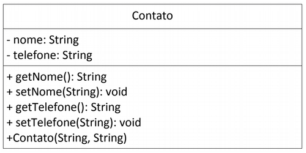

# Unidade 1 - Exercício 1 - 18/08/2024

## Nota: máximo 2,0 pontos se o commit no github for até 23:59:59h do dia 18/08/2024

### Questões - Faça em Java

1. (0,5) Corrija os erros do arquivo "Questao1.java" que estão no seu repositório.

2. (0,5) Em um método _main_, faça um programa que exiba para o usuário o menor inteiro positivo de uma lista ligada <inteiro> de 9999 números gerados aleatoriamente.

3. (0,5) Sabendo que latão é 70% de cobre e 30% de zinco, indique a quantidade de cada um desses componentes para se obter uma certa quantidade de quilos de latão que foi requerida pelo usuário.

4. (0,5) Construa e teste com 3 instâncias diferentes a classe a seguir. No toString() exiba todos os valores dos atributos, sendo que o nome deve ser exibido sempre em letra MAIÚSCULA. As 3 instâncias devem ser criadas no método _main_. O construtor é feito com 2 parâmetros. Os nomes nas instâncias devem ser de pintores renascentistas.

