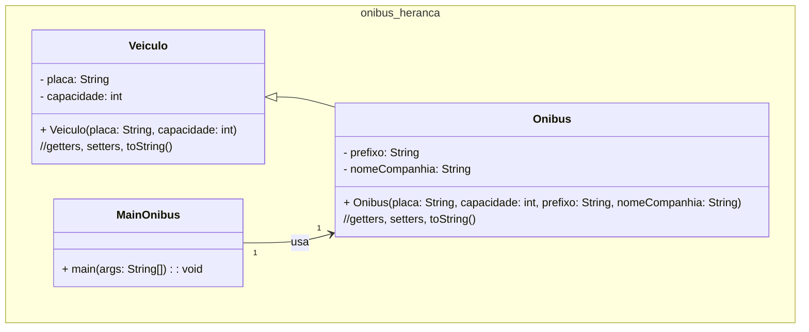

### Unidade 2 - Exercício 1 - Com nota em 06/09/2024 até as 22:30:00h

#### 0. (1,0) Veículo e Ônibus

Crie um programa em Java para gerenciar uma empresa de busão. Crie a classe Veículo, com a placa e capacidade. Um Ônibus é um veículo e possui atributos extras, como o prefixo e o nome da empresa que opera a linha. Faça uma classe separada, com método ```main```, para testar o programa, criando 2 veículos (1 carro e 1 ônibus). Exiba os veículos criados. Ao final, faça _commit_ e _push_ para o seu repositório no GitHub da disciplina. No diagrama de classes apresentado a seguir existem detalhes de implementação.



Pedaço do código da classe MainProduto:

```java
package onibus_heranca;

public class MainOnibus {
    public static void main(String[] args) {
        Veiculo umCarro = new Veiculo("OOO-15784", 5);
        Onibus umOnibus = new Onibus("Q9SACQ", 500, "51649Assu", "Pega o Guanabara");
        System.out.println(umCarro);
        System.out.println(umOnibus);
    }
}
```
