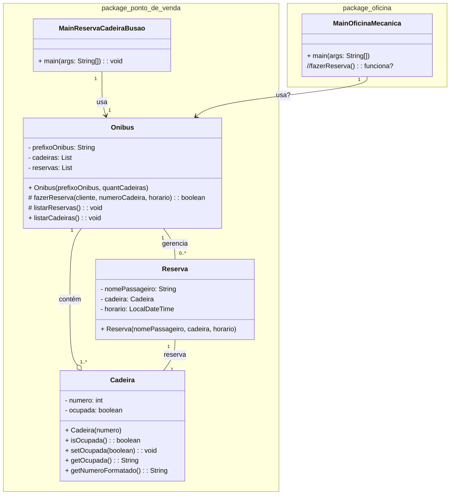
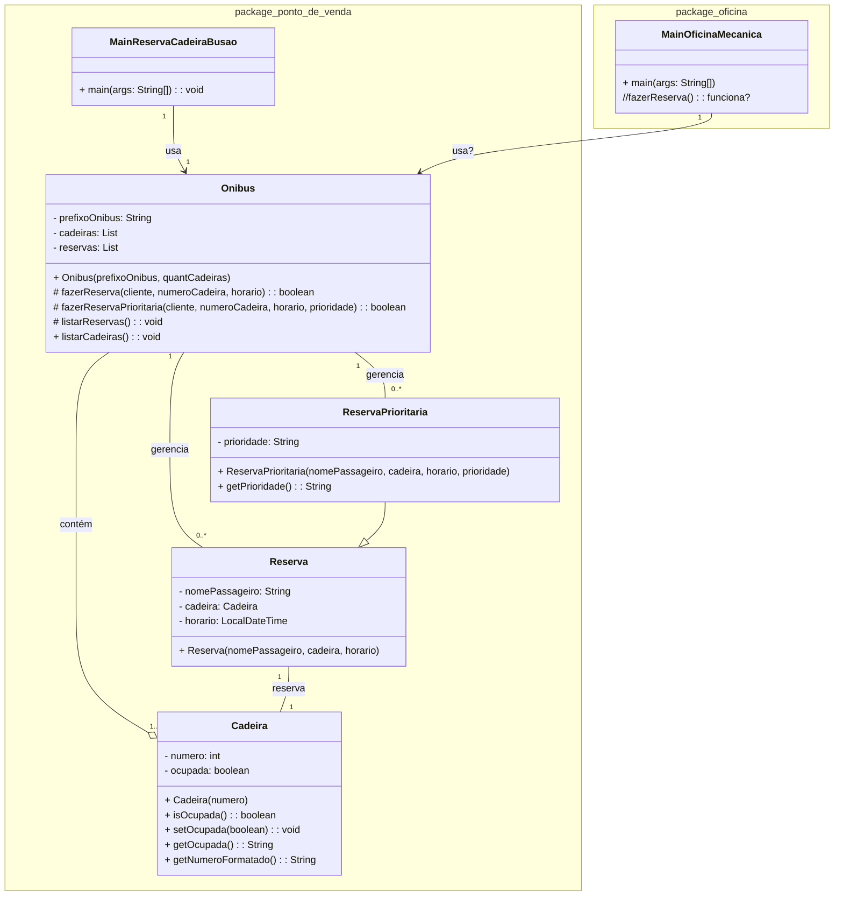

## Aula 8 - 06/09/2024 - Início de Herança

### Unidade 1 - Exercício 1 - Com nota em 06/09/2024 até as 22:00:00h

#### 0. (0,0) Reserva de Cadeira em um Ônibus

Crie um programa em Java para gerenciar reservas de cadeiras para passageiros em um ônibus, a ser usado por um atendente em um PDV na rodoviária. Sugere-se a criação da classe Cadeira, com uma identificação numérica e um indicativo se ela está ou não ocupada. Um Ônibus possui uma lista de cadeiras e uma lista de reservas, além da identificação do prefixo do ônibus (ou até o nome da empresa). A reserva é feita exclusivamente, de forma protegida de acesso externo, dentro da classe Ônibus. Uma reserva precisa conter a identificação do passageiro, a cadeira que ele reservou e a data e hora da reserva para a viagem. Faça uma classe separada, com método ```main```, para testar o programa, criando 4 reservas em um ônibus com 10 cadeiras. Duas dessas reservas devem ser inválidas, em uma cadeira de numero 15 e uma reserva em uma cadeira já ocupada. Ao final do teste, exiba todas as cadeiras e todas as reservas. Em outro pacote, que estaria num sistema de gerenciamento da oficina da empresa de ônibus, tente reservar uma cadeira. Ao final, faça _commit_ e _push_ para o seu repositório no GitHub da disciplina. No diagrama de classes apresentado a seguir existem detalhes de implementação.



#### 0. (1,0) Reserva Prioritária

Expandindo o exercício anterior, crie uma nova classe chamada `ReservaPrioritaria`, que herda da classe `Reserva`. Esta nova classe deve ser utilizada para reservas que possuem prioridade, como para idosos ou pessoas com deficiência. A classe `ReservaPrioritaria` deve incluir um atributo adicional chamado `prioridade`, do tipo `String`, que indique o motivo da prioridade (ex: "Idoso", "Deficiente").

Altere a classe `Onibus` para incluir um método protegido `fazerReservaPrioritaria`, que permita realizar reservas prioritárias. O método deve garantir que uma reserva prioritária só seja aceita se houver assentos disponíveis, da mesma forma que as reservas comuns.

Na classe de teste (`MainReservaCadeiraBusao`), crie um novo ônibus e faça 2 reservas prioritárias válidas e 1 inválida, que tenta reservar uma cadeira já ocupada. Ao final, exiba todas as cadeiras e todas as reservas, tanto comuns quanto prioritárias.

Implemente os métodos e testes conforme descrito e faça _commit_ e _push_ para o seu repositório no GitHub da disciplina. O diagrama de classes a seguir mostra os detalhes de implementação.


