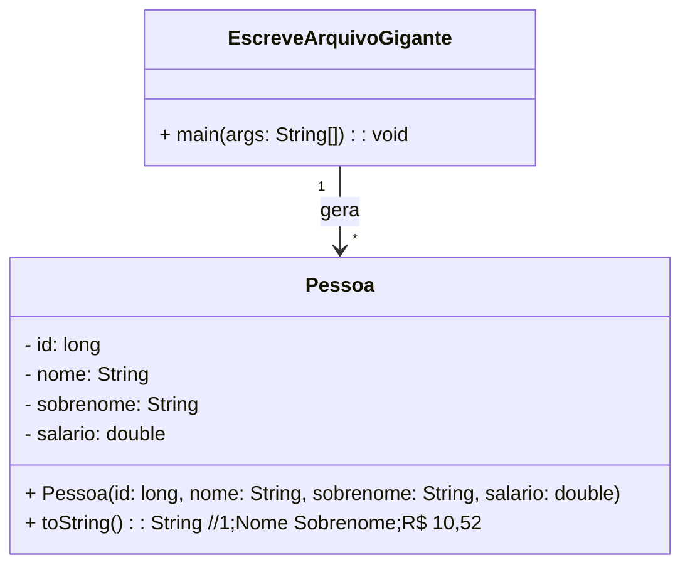

### Unidade 2 - Exercício 2 - Com nota em 27/09/2024 até as 22:20:00h

#### 1. (2,0) Salvando Pessoas

Crie um programa em Java para gerar um arquivo CSV contendo informações inventadas de pessoas. O programa deve incluir uma classe `Pessoa`, com os atributos `idPessoa`, `nome`, `sobrenome` e `salario`. O método `main` da classe EscreveArquivoGigante deve gerar 598187 registros de pessoas, com nomes e sobrenomes escolhidos aleatoriamente a partir de arrays predefinidos com 6 nomes cada. O salário deve ser um valor aleatório entre R$ 1.500,00 e R$ 150.000,00. As informações devem ser escritas em um arquivo chamado `pessoas.csv`, no formato "id;nome sobrenome;R$ salário,00". O método `toString()` da classe `Pessoa` deve ser usado para gerar a saída do arquivo CSV. Exiba uma mensagem de progresso a cada 100 registros gerados. Ao final faça _commit_ e _push_ para o seu repositório no GitHub da disciplina.

