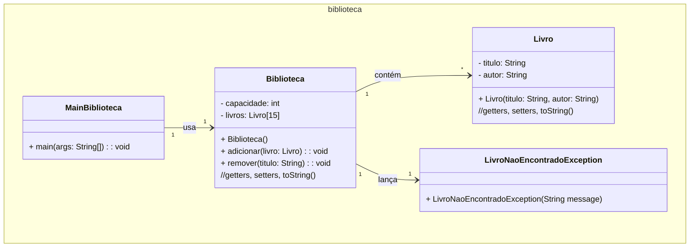

### Unidade 3 - Exercício 1 - Com nota em 11/10/2024 até as 22:30:00h

#### 0. (2,0) Biblioteca

Crie um programa em Java para gerenciar um sistema de biblioteca com uma capacidade fixa de 15 livros, armazenados em um array. Implemente a classe `Livro`, com atributos como título e autor. O sistema deve permitir a adição e remoção de livros. Crie uma exceção personalizada: `LivroNaoEncontradoException` para gerenciar a situação em que um livro não é encontrado na biblioteca. Faça uma classe separada com o método `main` para testar o programa, criando instâncias de `Livro` e simulando a adição e remoção de livros. Exiba mensagens apropriadas quando uma exceção for lançada. Ao final, faça _commit_ e _push_ para o seu repositório no GitHub da disciplina.



Pedaço do código da classe MainBiblioteca:

```java
public static void main(String[] args) {
    Biblioteca biblioteca = new Biblioteca();

    Livro livro1 = new Livro("O Senhor dos Anéis", "Tolkien");
    Livro livro2 = new Livro("Harry Potter", "Rowling");
    Livro livro3 = new Livro("A guerra dos tronos", "Martin");

    try {
        System.out.println("Adicionando...");
        biblioteca.adicionar(livro1);
        biblioteca.adicionar(livro2);
        biblioteca.adicionar(livro3);
        System.out.println("3 livros adicionados.");

        System.out.println("Removendo...");
        biblioteca.remover("Harry Potter");
        biblioteca.remover("Dom Casmurro");
        System.out.println("1 livro removido.");
    } catch (LivroNaoEncontradoException e) {
        System.out.println(e.getMessage());
    }
}
```
