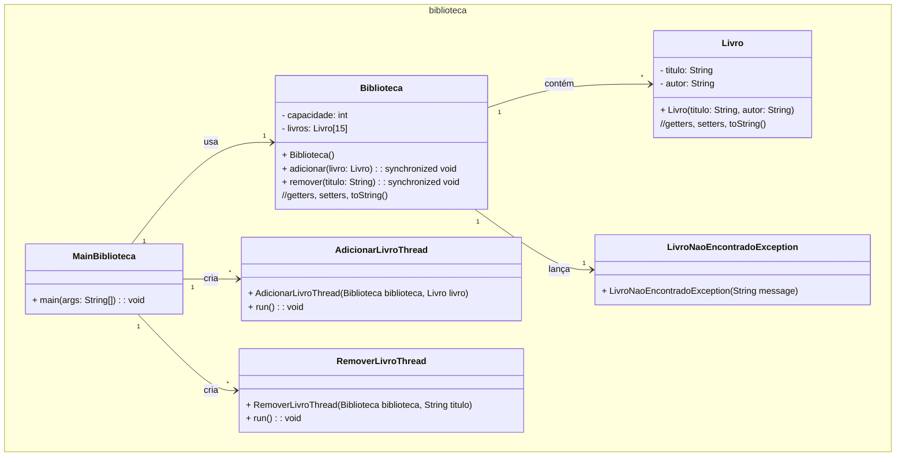

### Unidade 3 - Exercício 2 - Com nota em 18/10/2024 até as 22:30:00h

#### 0. (3,0) Biblioteca Multithread

Crie um programa em Java para gerenciar um sistema de biblioteca com uma capacidade fixa de 15 livros, armazenados em um array. Implemente a classe `Livro`, com atributos como título e autor. O sistema deve permitir a adição e remoção de livros, utilizando **threads** para simular várias operações simultâneas. Crie uma exceção personalizada: `LivroNaoEncontradoException` para gerenciar a situação em que um livro não é encontrado na biblioteca. As operações de adição e remoção de livros devem ser sincronizadas. Faça uma classe separada com o método `main` para testar o programa, criando instâncias de `Livro` e simulando a adição e remoção de livros em diferentes threads. Exiba mensagens apropriadas quando uma exceção for lançada. Ao final, faça _commit_ e _push_ para o seu repositório no GitHub da disciplina.



Pedaço do código da classe MainBiblioteca:

```java
public static void main(String[] args) {
    Biblioteca biblioteca = new Biblioteca();

    Livro livro1 = new Livro("O Senhor dos Anéis", "Tolkien");
    Livro livro2 = new Livro("Harry Potter", "Rowling");
    Livro livro3 = new Livro("A guerra dos tronos", "Martin");

    Thread adicionar1 = new Thread(new AdicionarLivroThread(biblioteca, livro1));
    Thread adicionar2 = new Thread(new AdicionarLivroThread(biblioteca, livro2));
    Thread adicionar3 = new Thread(new AdicionarLivroThread(biblioteca, livro3));
    
    Thread remover1 = new Thread(new RemoverLivroThread(biblioteca, "Harry Potter"));
    Thread remover2 = new Thread(new RemoverLivroThread(biblioteca, "Dom Casmurro"));

    try {
        System.out.println("Executando threads de adição...");
        adicionar1.start();
        adicionar2.start();
        adicionar3.start();

        adicionar1.join();
        adicionar2.join();
        adicionar3.join();
        System.out.println("Livros adicionados.");

        System.out.println("Executando threads de remoção...");
        remover1.start();
        remover2.start();

        remover1.join();
        remover2.join();
        System.out.println("Livros removidos.");
    } catch (InterruptedException e) {
        System.out.println("Thread interrompida.");
    } catch (LivroNaoEncontradoException e) {
        System.out.println(e.getMessage());
    }
}
```
